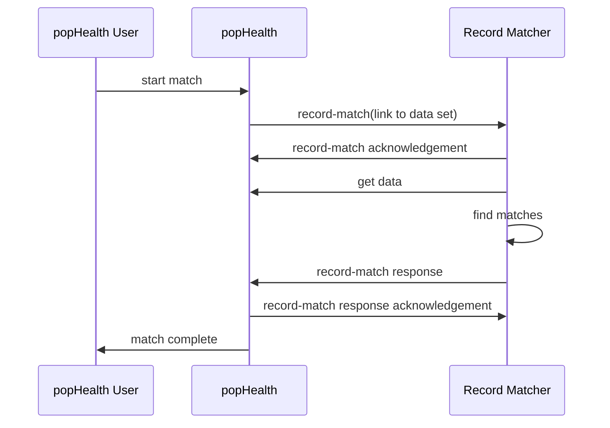

#PopHealth Record Matching System Interface

version 0.1
xx December 2015
The MITRE Corporation

[TOC]

##Introduction
###Purpose
This document describes the interface that popHealth provides to a Record Matching System.  The interface leverages both [FHIR Messaging](http://www.hl7.org/implement/standards/fhir/messaging.html) and [RESTful FHIR Search](http://hl7.org/fhir/search.html).

### Scope
This document describes the interaction that between popHealth and a record matching system from the time that popHealth initiates a request for a matching operation to when the matching results are returned.

This document does not specify how popHealth is made aware of any record matching system or how to configure a record matching system to work with popHealth. It also does not specify the mechanism by which a record matching system authenticates with popHealth to obtain data.

### Assumptions
1. This document assumes FHIR Specification [DSTU2](http://hl7.org/fhir/timelines.html), which is the current officially released version at the time of writing.

### Technical Approach
popHealth will use a FHIR message to initiate a matching operation.  The record-match message contains information that allows the record matching system to make a RESTful FHIR Search call to retrieve the data that is to be processed. On receipt of the record-match request, the record matching system should respond with a message that indicates whether it accepts or rejects the message.  If the request is rejected, an error code that indicates the reason should be provided. When the record matching system accepts a record-match request and finishes processing it, the record matching system sends a FHIR message containing the match results back to popHealth. Pophealth, in turn can make the results available to the popHealth user who had requested the operation.  These high level steps can be depicted as:

### Use Cases
There are two use cases covered by this interface definition.

In the first use case, popHealth requests a record matching system process a single data set and return information about records it considers the same. Loosely speaking, the record matcher is being asked to identify potential duplicate records in a master record list.

In the second use case, popHealth requests the record matcher return information about matches of records from one data set (a.k.a,, query list) found in a second data set (a.k.a., master record list). This is like giving a record matcher a list of names (i.e., query list) and asking it to look in some larger data set to find records that match those names.

## Message Definitions

### record-match Request

The record-match message is a FHIR Message sent by popHealth to direct a record matching system to process one or two data sets.  The data sets are described by RESTful FHIR Search expressions.  The record matching system obtains the resources in the data set by invoking the FHIR Search service.

The search expression includes the component parts that allow the record matching system to invoke a RESTful a FHIR Search. The record matching system may use either the HTTP GET or POST method to invoke the Search service. The response from popHealth shall be conformant with the [FHIR Search RESTful API](http://hl7.org/fhir/http.html#search)

#### Message Structure

The general structure of the record-match message is presented below.

- Bundle
    - id -- _identifier of the bundle_
	- type "message"
	- entry
     	- fullUrl -- *sender-generated uuid*
     	- resource
	    	- MessageHeader
    			- id -- _identifier of the message_
    			- timestamp -- _time the message was sent_
    			- event
    				- system "https://github.com/popHealth" -- _namespace for record-match message event code_
    				- code	"record-match" -- code value to denote a record-match message
				- source
					- endpoint -- _the address to which responses to this message should be sent_
				- destination
					- endpoint --address of the destination application (i.e., the record matching system).  
				- author
					- reference	-- _reference to the popHealth user (Practitioner) that constructed the matching request.  The Practitioner resource is provided in another entry in this bundlel_
				- data
					- reference	-- _reference to a Parameters resource with information for a search expression to retrieve the master record list_
				- data -- _Included only when record matching system is to directed to find potential matches to items in a query list_
					- reference -- _reference to a Parameters resource with information for a search expression that will result in the records that comprise the query list_
	- entry
     	- fullUrl -- *sender-generated uuid that identifies this entry*
		- resource
			- Parameters
				- parameter
					- name "type"
					- valueString "master"
				- parameter
					- name "resourceType" -- _denotes the type of resource that will be returned by the search expression_
					- valueString "Patient" -- _code value from the [resource-types] (https://www.hl7.org/implement/standards/fhir/valueset-resource-types.html) value set_
				- parameter
					- name "searchExpression"
                   	- resource
                   	 	- Parameters
                   			- parameter
                   				- name "resourceUrl" -- _base URL of the search epxression (i.e., everything before the question mark if the search expression is submitted using HTTP GET_ 
                   				- valueUri
                   			- parameter -- _zero or more parameter elements that comprise the query expression_
                   				- name -- _name of search parameter from [Patient Search Parameters](http://www.hl7.org/implement/standards/fhir/patient.html#search)_
                   				- value[x] -- _value and, when applicable, prefix and modifier_
	- entry -- _Included only if record matching system is directed to search the master record list for matches of items in a query list_
     	- fullUrl -- *sender-generated uuid that identifies this entry*
		- resource
			- Parameters
				- parameter
					- name "type"
					- valueString "query"
				- parameter
					- name "resourceType" -- _denotes the type of resource that will be returned by the search expression_
					- valueString "Patient" -- _code value from the [resource-types] (https://www.hl7.org/implement/standards/fhir/valueset-resource-types.html) value set_
				- parameter
					- name "searchExpression"
                   	- resource
                   	 	- Parameters
                   			- parameter
                   				- name "resourceUrl" -- _base URL of the search epxression (i.e., everything before the question mark if the search expression is submitted using HTTP GET_ 
                   				- valueUri
                   			- parameter -- _zero or more parameter elements that comprise the query expression_
                   				- name -- _name of search parameter from [Patient Search Parameters](http://www.hl7.org/implement/standards/fhir/patient.html#search)_
                   				- value[x] -- _value and, when applicable, prefix and modifier_
	- entry
     	- fullUrl -- *sender-generated uuid that identifies this entry*
		- resource
			- Practitioner
				- identifier
					- use "usual"
					- system "https://github.com/pophealth/users" -- _uri of code space that represents popHealth user identifiers (e.g., user names)_
					- value -- _popHealth user name or other identifier_

See the FHIR Specification for the data type definitions and optional elements for the  resources used in the record-match message.
- [Bundle](http://www.hl7.org/implement/standards/fhir/bundle.html)
- [MessageHeader](http://www.hl7.org/implement/standards/fhir/messageheader.html)
- [Parameters](http://www.hl7.org/implement/standards/fhir/parameters.html)
- [Practitioner](http://www.hl7.org/implement/standards/fhir/practitioner.html)

The messasge header will contain one or two data elements that reference a Parameters resource that appears in an entry element in the message. The Parameters resource provides information that allows the record matching system to construct and then invoke a FHIR Search operation in order to retrieve data to process. 

One data element is provided when the record matching system is expected to identify records that are potentially duplicates in the data set.  Two data elements are provided when the record matcher is being directed to look in the first data set (i.e., master record list) for potential matches of each of the records in the second data set (i.e., query list).

#### Example Messages

- Single Request Parameter: [JSON](record-match-json-example-01.md) | [XML](record-match-xml-example-01.md)
- Two Request Parameters: [JSON](record-match-json-example-02.md) | [XML](record-match-json-example-02.md)

### record-match acknowledgement
A record matching system should send a message acknowledging receipt of a record-match message. An acknowledgement is recommended because the time to complete the requested matching operation may be significant.

When the record matching system will accept and process the record-match request, the acknowledgement message will contain a Message Header with response code value, "ok".

When the record matcher rejects a record-match request, the MessageHeader must have the response code value, "fatal-error" and reference an [OperationOutcome](http://hl7.org/fhir/DSTU2/operationoutcome.html) resource contained in another entry in the bundle.

The OperationOutcome must have issue severity value, "error" and an issue code value from the value set, [issue-type](http://www.hl7.org/implement/standards/fhir/valueset-issue-type.html). The issue code provides popHealth with information about why the record matching system will not process the request. Human-friendly text that complements the issue code may also be provided in an issue details element.

#### Message Structure

- Bundle
    - id -- _identifier of the bundle_
	- type "message"
	- entry
     	- fullUrl -- *sender-generated uuid that identifies this entry*
     	- resource
    		- MessageHeader
    			- id -- _identifier of the message_
    			- timestamp -- _time the message was sent_
    			- event
	    			- system "https://github.com/popHealth" -- _namespace for record-match message event code_
    				- code	"record-match" -- _code value to denote a record-match message_
				- response
					- identifier -- _identifier of the message for which this is a response_
					- code "ok | fatal-error" -- *See [Response Type](http://www.hl7.org/implement/standards/fhir/valueset-response-code.html) in the FHIR Specification*
					- details -- _included only if the response code is fatal-error_
						- reference -- _reference to an OperationOutcome resource that contains information about the error_
				- source
					- endpoint -- _the address of the sender of this response message_
				- destination
					- endpoint -- _address of the application to which the response is directed (i.e., popHealth)_
	- entry -- _Included only if the record matching system is rejecting the record-match request_
     	- fullUrl -- *sender-generated uuid that identifies this entry*
		- resource
			- OperationOutcome
				- id -- _identifier of this OperationOutcome resource; referenced above in MessageHeader_
				- issue
					- severity -- "fatal-error" _The literal value, "fatal-error" denotes the record matching system cannot recover from the reported error and will not process the request._
					- code -- _value from the value set,  [issue-type](http://www.hl7.org/implement/standards/fhir/valueset-issue-type.html)_

					- details -- _Optional_
						- text -- _Human-friendly description of the error or reason the record matching system is rejecting the request_

See the FHIR Specification for the data type definitions and optional elements for the  resources used in this message.
- [Bundle](http://www.hl7.org/implement/standards/fhir/bundle.html)
- [MessageHeader](http://www.hl7.org/implement/standards/fhir/messageheader.html)
- [OperationOutcome](http://www.hl7.org/implement/standards/fhir/operationoutcome.html)

#### Example Messages
- Example 1 [JSON](record-match-ack-json-example-01.md) | [XML](record-match-ack-xml-example-01.md)

### record-match Response
The record-match response message provides a information about each potential match identified by the record matcher.

The record-match response will be a FHIR Bundle that contains a MessageHeader resource. The MessageHeader response code value, "ok" will indicate that the record matching system has successfully completed its matching run. In the case where the record matching system encounters and error, an [OperationOutcome](http://hl7.org/fhir/DSTU2/operationoutcome.html) resource will also be included.

The message header will have one or two data references. These will refer to Bundle entries which describe the query list and the master record list.

Lastly, the Bundle will include zero or more entries to represent links between records that the matching system has discovered. The entry shall use the [Patient Matching using an MPI](http://hl7.org/fhir/DSTU2/patient.html#match) extension. This extension will be used to represent the quality of the link between records.

- Bundle
    - id
  - type "message"
  - entry
    - fullUrl -- *sender-generated uuid*
    - resource
      - MessageHeader
        - id -- *sender-generated uuid*
        - timestamp -- _time the message was sent_
        - event
          - system "https://github.com/popHealth"
          - code  "record-match"
        - source
          - endpoint -- The URI identifying the patient matching system
          - name [Opt]
        - destination
          - endpoint -- The URI identifying the popHealth test harness
        - data
          - reference -- a reference to the query list
        - data
          - reference -- a reference to the master record list
  - entry
    - fullUrl
    - request
      -method -- value=GET
      -url -- The FHIR Search string to represent either the query list or master record list
  - entry
    - fullUrl -- A link to one of the records on the FHIR server
    - link
      - relation -- value=type
      - url -- The resource type for the records being matched. The initial cases will be matches between FHIR Patient resources (value=http://hl7.org/fhir/Patient)
    - link
      - relation -- value=related
      - url -- A link to a record that is related to the resource specified in the fullUrl
    - search
      - extension -- Patient Matching using an MPI FHIR extension
        - valueCode -- Values that conform to the [MPIMatch](http://hl7.org/fhir/DSTU2/valueset-patient-mpi-match.html) value set. The value will indicate the match quality.
      - score -- All entries SHALL have a score from 0 to 1, where 1 is the most certain 

#### Example Messages
- Example 1 JSON | [XML](record-match-response-xml-example-01.md)

## Message Delivery Mechanism
Section 2.4.4.1 of the FHIR Specification defines how a FHIR Server might offer a RESTful endpoint as central point for exchanging asynchronous messages. popHealth will use such an endpoint to exchange messages with a record matching system.

Note: The message brokering capability of a FHIR Server is considered distinct from the popHealth Record Matching System Interface. The message brokering capability may be provided by popHealth, the record matching system, or some other system.

popHealth must be configurable to poll a FHIR Server for messages directed to popHealth.  popHealth should allow the interval at which it polls the FHIR Server for messages to be configurable.

popHealth may provide a capability to receive the record-match response FHIR message by providing a RESTful endpoint that can accept the message directly.

popHealth must distinguish between the destination of the message, which is the record matching system, and the server to which it sends the message for brokering. This may be the same endpoint if the record matching system acts as the central point of message exchange.

A record matching system must provide a capability to receive the record-match FHIR message.  This may be either by providing a RESTful endpoint that can accept the message directly or by polling a FHIR Server for messages directed to the record matching system.

The record matching system should allow the interval at which it polls a FHIR Server for messages to be configurable.

### Search Parameters
The [Patient Search Parameters](http://www.hl7.org/implement/standards/fhir/patient.html#search) will be the initial set of supported search parameters used in the record-match message.

### Security Implementation Guidance
All RESTful service invocations should be via the HTTPS protocol.

The process of authenticating with any of the involved FHIR Servers is outside the scope of this interface.

## Resources
- [FHIR DSTU2 Specification](http://hl7.org/fhir/index.html)
- [FHIR Messaging](http://www.hl7.org/implement/standards/fhir/messaging.html)

