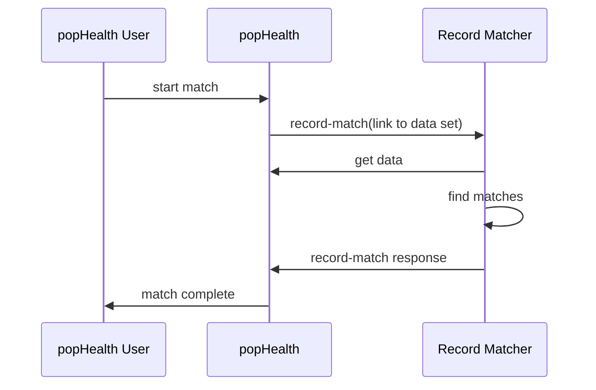

#PopHealth Record Matching System Interface

version 0.1
xx December 2015
The MITRE Corporation

[TOC]

##Introduction
###Purpose
This document describes the interface that popHealth provides to a Record Matching System.  The interface leverages both [FHIR Messaging](http://www.hl7.org/implement/standards/fhir/messaging.html) and [RESTful FHIR Search](http://hl7.org/fhir/search.html).

### Scope
This document describes the interaction that between popHealth and a record matching system from the time that popHealth initiates a request for a matching operation to when the matching results are returned.

This document does not specify how popHealth is made aware of any record matching system or how to configure a record matching system to work with popHealth. It also does not specify the mechanism by which a record matching system authenticates with popHealth to obtain data.

### Assumptions
1. This document assumes FHIR Specification [DSTU2](http://hl7.org/fhir/timelines.html), which is the current officially realeased version at the time of writing.

### Technical Approach
popHealth will use a FHIR message to initiate a matching operation.  The record-match message contains information that allows the record matching system to make a RESTful FHIR Search call to retrieve the data that is to be processed. When the record matching system completes its processing, it sends a FHIR message containing the match results back to popHealth.  These high level steps can be depicted as:

### Use Cases
There are two use cases covered by this interface definition.

In the first use case, popHealth requests a record matching system process a single data set and return information about records it considers the same. Loosely speaking, the record matcher is being asked to identify potential duplicate records in a data set.

In the second use case, popHealth requests the record matcher return information about matches of records from one data set (a.k.a,, query list) found in a second data set (a.k.a., target list). This is like giving a record matcher a list of names (i.e., query list) and asking it to look in some larger data set to find records that match those names.

## Message Definitions

### record-match Request

The record-match message is 

#### Message Parameters
1. query list search URL
2. target list search URL

#### Example Messages

- [Example 1 JSON](record-match-json-example-01.md)
- [Example 1 XML](record-match-xml-example-01.md)

### record-match Response
#### Example Messages
- [Example 1 XML](record-match-response-xml-example-01.md)

## Message Delivery Mechanism
Section 2.4.4.1 of the FHIR Specification defines how a FHIR Server might offer a RESTful endpoint as central point for exchanging asynchronous messages. popHealth will use such an endpoint to exchange messages with a record matching system.

Note: The message brokering capability of a FHIR Server is considered distinct from the popHealth Record Matching System Interface. The message brokering capability may be provided by popHealth, the record matching system, or some other system.

popHealth must be configurable to poll a FHIR Server for messages directed to popHealth.  popHealth should allow the interval at which it polls the FHIR Server for messages to be configurable.

popHealth may provide a capability to receive the record-match response FHIR message by providing a RESTful endpoint that can accept the message directly.

popHealth must distinguish between the destination of the message, which is the record matching system, and the server to which it sends the message for brokering. This may be the same endpoint if the record matching system acts as the central point of mesasge exchange.

A record matching system must provide a capability to receive the record-match FHIR message.  This may be either by providing a RESTful endpoint that can accept the message directly or by polling a FHIR Server for messages directed to the record matching system.

The record matching system should allow the interval at which it polls a FHIR Server for messages to be configurable.

### Search Parameters
The [Patient Search Parameters](http://www.hl7.org/implement/standards/fhir/patient.html#search) will be the initial set of supported search parameters used in the record-match message.

### Security Implementation Guidance
RESTful service invocations should be via the HTTPS protocol.

The process of authenticating with any of the involved FHIR Servers is outside the scope of this interface.

## Resources
- [FHIR DSTU2 Specification](http://hl7.org/fhir/index.html)
- [FHIR Messaging](http://www.hl7.org/implement/standards/fhir/messaging.html)

_____
_____
_____

##__WHERE DO THE FOLLOWING GO__

### Actor Summary
popHealth
FHIR Server
record matcher - generic term

### Privacy, Security,  and Consent

## Specification and Conformance Requirements
### Definitions, Interpretations and Requirements common to all actors
FHIR Infrastructure usage: DAF uses FHIR RESTful API based on HTTP protocol along with FHIR data types, FHIR search and both xml and json FHIR Resource Formats. 

### Conformance Requirements for each Actor
MessageHeader
id
identifier
timestamp
event
source
destination
tag

Leave for later draft
status-request (operation definition)
status response
