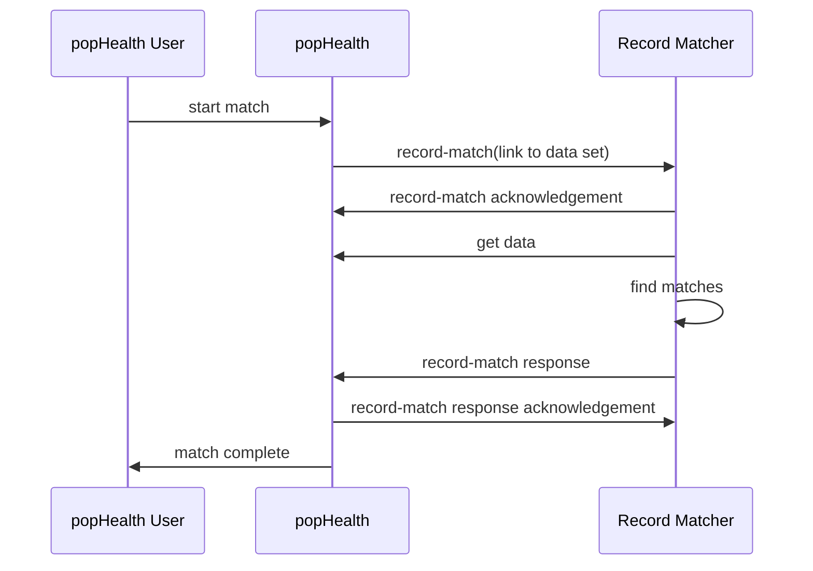

#PopHealth Record Matching System Interface

version 0.1
xx December 2015
The MITRE Corporation

[TOC]

##Introduction
###Purpose
This document describes the interface that popHealth provides to a Record Matching System.  The interface leverages both [FHIR Messaging](http://www.hl7.org/implement/standards/fhir/messaging.html) and [RESTful FHIR Search](http://hl7.org/fhir/search.html).

### Scope
This document describes the interaction that between popHealth and a record matching system from the time that popHealth initiates a request for a matching operation to when the matching results are returned.

This document does not specify how popHealth is made aware of any record matching system or how to configure a record matching system to work with popHealth. It also does not specify the mechanism by which a record matching system authenticates with popHealth to obtain data.

### Assumptions
1. This document assumes FHIR Specification [DSTU2](http://hl7.org/fhir/timelines.html), which is the current officially released version at the time of writing.

### Technical Approach
popHealth will use a FHIR message to initiate a matching operation.  The record-match message contains information that allows the record matching system to make a RESTful FHIR Search call to retrieve the data that is to be processed. When the record matching system completes its processing, it sends a FHIR message containing the match results back to popHealth.  These high level steps can be depicted as:

### Use Cases
There are two use cases covered by this interface definition.

In the first use case, popHealth requests a record matching system process a single data set and return information about records it considers the same. Loosely speaking, the record matcher is being asked to identify potential duplicate records in a data set.

In the second use case, popHealth requests the record matcher return information about matches of records from one data set (a.k.a,, query list) found in a second data set (a.k.a., master record list). This is like giving a record matcher a list of names (i.e., query list) and asking it to look in some larger data set to find records that match those names.

## Message Definitions

### record-match Request

The record-match message is a FHIR Message sent by popHealth to direct a record matching system to process one or two data sets.  The data sets are described by RESTful FHIR Search expressions.  The record matching system obtains the resources in the data set by invoking the FHIR Search service.

#### Message Structure

The general structure of the record-match message is presented below.

- Bundle
    - id -- _identifier of the bundle_
	- type "message"
	- entry
     	- fullUrl -- *sender-generated uuid*
     	- resource
	    	- MessageHeader
    			- id -- _identifier of the message_
    			- timestamp -- _time the message was sent_
    			- event
    				- system "https://github.com/popHealth" -- _namespace for record-match message event code_
    				- code	"record-match" -- code value to denote a record-match message
				- source
					- endpoint -- _the address to which responses to this message should be sent_
				- destination
					- endpoint --address of the destination application (i.e., the record matching system).  
				- author
					- reference	-- _reference to the popHealth user (Practitioner) that constructed the matching request.  The Practitioner resource is provided in another entry in this bundlel_
				- data
					- reference
				- data
					- reference
	- entry
		- fullUrl
		- resource
			- Parameters
				- parameter
					- name "type"
					- valueString "query"
                   - parameter
					- name "resourceType"
					- valueString "Patient"
                   - parameter
                   	- name "searchExpression"
                   	- resource
                   	 	- Parameters
                   			- parameter
                   				- name
	- entry
		- fullUrl
		- resource
			- Practitioner
				- 

See the FHIR Specification for the data type definitions and optional elements for the  resources used in the record-match message.
- [Bundle](http://www.hl7.org/implement/standards/fhir/bundle.html)
- [MessageHeader](http://www.hl7.org/implement/standards/fhir/messageheader.html)
- [Parameters](http://www.hl7.org/implement/standards/fhir/parameters.html)

#### Message Header

The messasge header will contain one or two data elements that reference a Parameters resource that appears in an entry element in the message. The Parameters resource provides information that allows the record matching system to invoke a FHIR Search operation in order to retrieve data to process. One data element is provided when the record matching system is expected to identify records that are potentially duplicates in the data set.  Two data elements are provided when the record matcher is being directed to look in the second data set (i.e., targetList) for potential matches of each of the records in the first data set (i.e., queryList)

#### Message Parameters
1. master record list search URL
2. query list search URL

#### Example Messages

- Example 1 [JSON](record-match-json-example-01.md) | [XML](record-match-xml-example-01.md)

### record-match acknowledgement
A record matching system should send a message acknowledging receipt of a record-match message. This immediate response is recommended because the time to complete the requested matching operation may be significant.

The acknowledgement message will contain a Message Header. In the case of where the record matching rejects the request an [OperationOutcome](http://hl7.org/fhir/DSTU2/operationoutcome.html) resource will also be included.

The MessageHeader response code value, "ok" will indicate that the record matching system has accepted the request.

When the record matcher rejects a record-match request, the MessageHeader response code must have a value of "fatal-error" and the bundle must contain an OperationOutcome. This OperationOutcome must have severity value, "error" and a code value from the value set, [issue-type](http://www.hl7.org/implement/standards/fhir/valueset-issue-type.html).

#### Message Structure

- Bundle
    - id -- _identifier of the bundle_
	- type "message"
	- entry
     	- fullUrl -- *sender-generated uuid*
     	- resource
    		- MessageHeader
    			- id -- _identifier of the message_
    			- timestamp -- _time the message was sent_
    			- event
	    			- system "https://github.com/popHealth" -- _namespace for record-match message event code_
    				- code	"record-match" -- code value to denote a record-match message
				- response
					- identifier -- _identifier of the message for which this is a response_
					- code "ok | fatal-error" -- *See [Response Type](http://www.hl7.org/implement/standards/fhir/valueset-response-code.html) in the FHIR Specification*
					- details -- _included only if the response code is fatal-error_
						- reference -- _reference to an OperationOutcome resource that contains information about the error_
				- source
					- endpoint -- *the address to which responses to this message should be sent*
				- destination
					- endpoint -- *address of the destination application (i.e., popHealth). This will normally be the source.endpoint in the request message*
	- entry
		- resource
			- OperationOutcome
				- issue
					- severity
					- code

See the FHIR Specification for the data type definitions and optional elements for the  resources used in this message.
- [Bundle](http://www.hl7.org/implement/standards/fhir/bundle.html)
- [MessageHeader](http://www.hl7.org/implement/standards/fhir/messageheader.html)
- [OperationOutcome](http://www.hl7.org/implement/standards/fhir/operationoutcome.html)

#### Example Messages
- Example 1 [JSON](record-match-ack-json-example-01.md) | [XML](record-match-ack-xml-example-01.md)

### record-match Response
The record-match response message provides a information about each potential match identified by the record matcher.

#### Example Messages
- Example 1 JSON | [XML](record-match-response-xml-example-01.md)

## Message Delivery Mechanism
Section 2.4.4.1 of the FHIR Specification defines how a FHIR Server might offer a RESTful endpoint as central point for exchanging asynchronous messages. popHealth will use such an endpoint to exchange messages with a record matching system.

Note: The message brokering capability of a FHIR Server is considered distinct from the popHealth Record Matching System Interface. The message brokering capability may be provided by popHealth, the record matching system, or some other system.

popHealth must be configurable to poll a FHIR Server for messages directed to popHealth.  popHealth should allow the interval at which it polls the FHIR Server for messages to be configurable.

popHealth may provide a capability to receive the record-match response FHIR message by providing a RESTful endpoint that can accept the message directly.

popHealth must distinguish between the destination of the message, which is the record matching system, and the server to which it sends the message for brokering. This may be the same endpoint if the record matching system acts as the central point of mesasge exchange.

A record matching system must provide a capability to receive the record-match FHIR message.  This may be either by providing a RESTful endpoint that can accept the message directly or by polling a FHIR Server for messages directed to the record matching system.

The record matching system should allow the interval at which it polls a FHIR Server for messages to be configurable.

### Search Parameters
The [Patient Search Parameters](http://www.hl7.org/implement/standards/fhir/patient.html#search) will be the initial set of supported search parameters used in the record-match message.

### Security Implementation Guidance
RESTful service invocations should be via the HTTPS protocol.

The process of authenticating with any of the involved FHIR Servers is outside the scope of this interface.

## Resources
- [FHIR DSTU2 Specification](http://hl7.org/fhir/index.html)
- [FHIR Messaging](http://www.hl7.org/implement/standards/fhir/messaging.html)

_____
_____
_____

##__WHERE DO THE FOLLOWING GO__

### Privacy, Security,  and Consent

## Specification and Conformance Requirements

### Conformance Requirements for each Actor
MessageHeader
id
identifier
timestamp
event
source
destination
tag

Leave for later draft
status-request (operation definition)
status response
